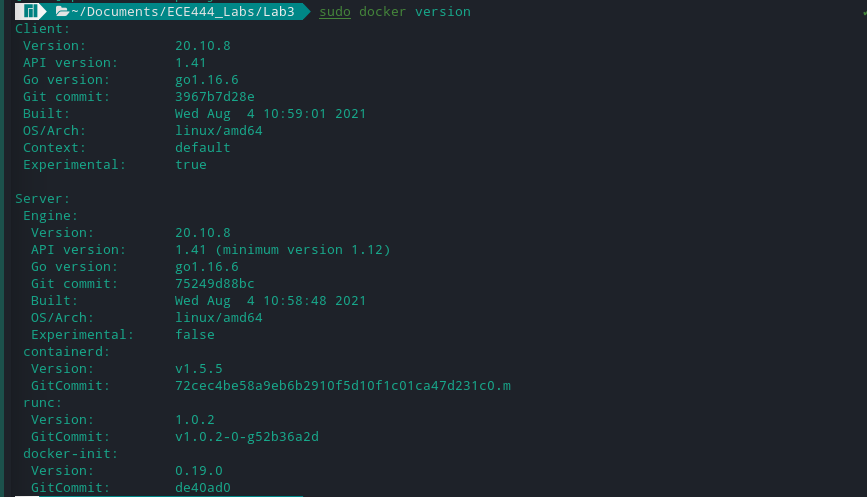
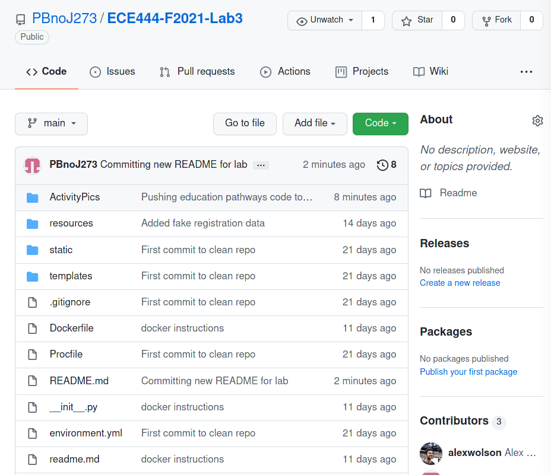
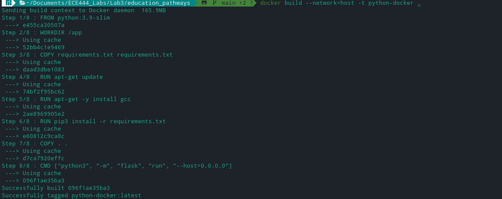
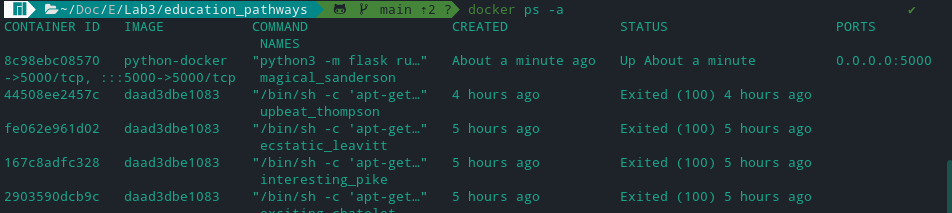
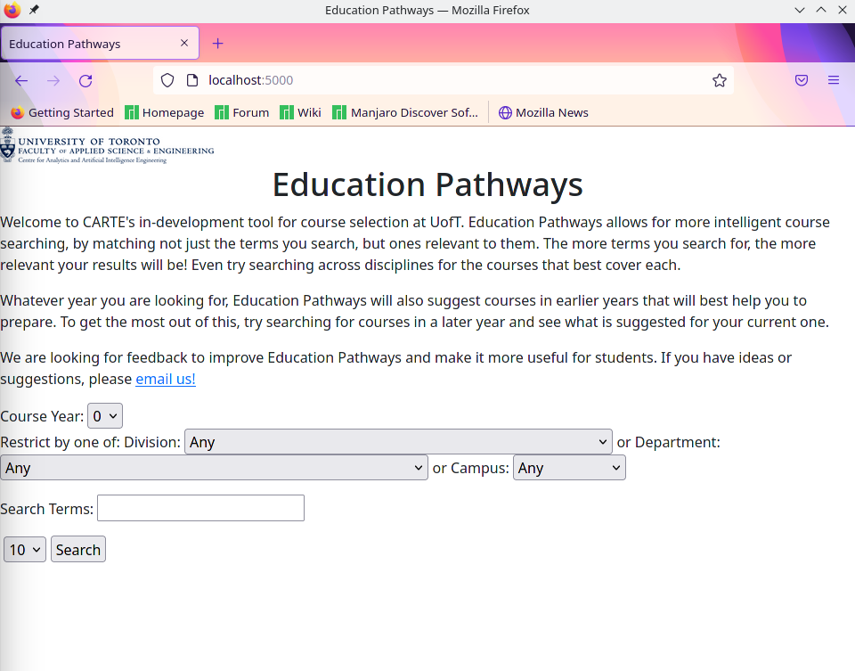

# README
By: Puneet Singh Bagga

This repo is a copy of https://github.com/nelaturuk/education_pathways

## Activity 1

## Activity 2

## Activity 3

## Activity 4

## Activity 5
### Functional Objective
Currently the Education pathways application only has the ability to search and display results to the user. The result of this search is based on the user adding every field and doing a search. 

The application should be extended to have the ability of doing partial searches and furthermore providing recommended/popular courses with some of the predefined filters. For example, if a user puts in Faculty of Engineering, thats all they should need to get a list of all the engineering courses. Or they can search of courses for key names only. This can extend to popular search items in different filters so if someone has picked faculty of engineering it should recommend the most popular courses and change based on the search items. We can also extend this into user accounts which would take in the user's program and give suggestions based on that.

### Non-Functional Objective
Currently, UX is pretty bland and is confusing to operate. Additionally, it is not well organized to help students search for items. There should be UI/UX improvements to make the site more captivating and the search categories should be better organized for viewing and understanding. There should also be more information provided on how to search (I.E. Example in the text box). The performance is quite poor as well, the search does not feel instant and takes quite a bit of time. It also does not have any indication that the user request has been completed or is being completed. Google has this in their 'time it took to complete search' text under the search bar and it also provides how many resutls there are.
